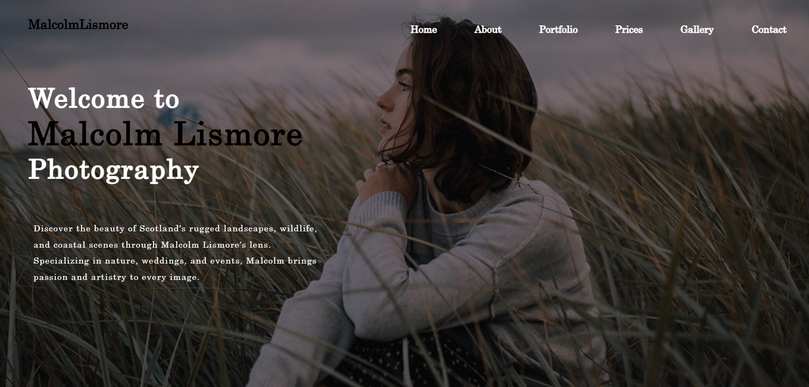
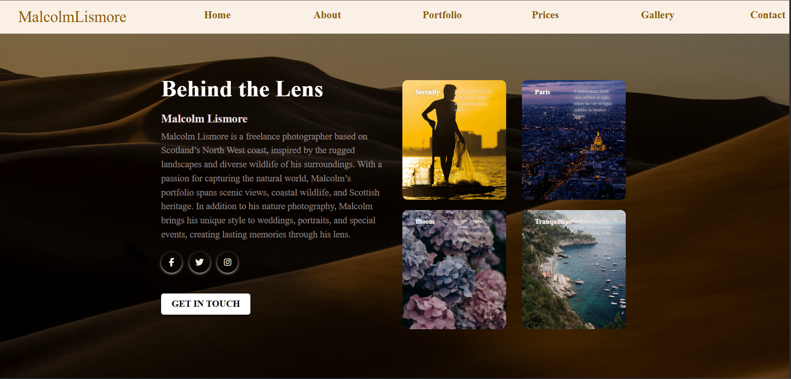
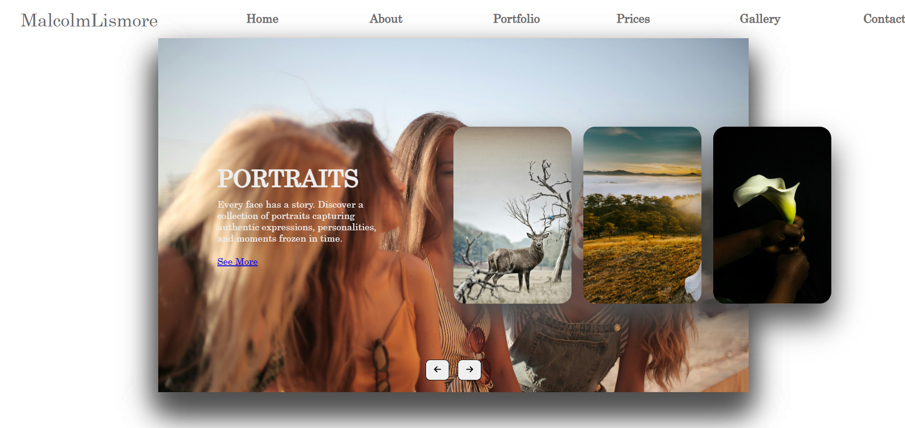
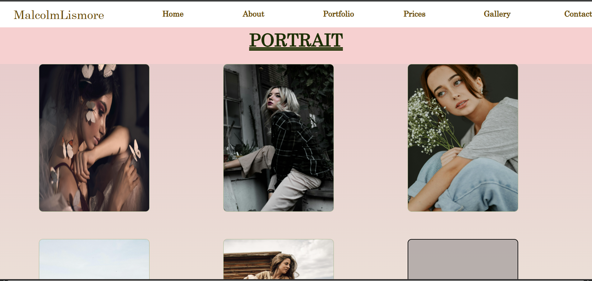

# malcolm-lismore-site (HTML, CSS, JavaScript)

This is a fully responsive photography website with pages for pricing, gallery, about, and contact. Developed using HTML5, CSS3, and JavaScript. Designed for a fictional photography brand "MalcolmLismore".

## 🌐 Pages Included
- Home
- About
- Portfolio
- Prices
- Gallery
- Contact

## 🎨 Features
- Responsive design
- Service-based pricing page
- Clean and modern UI
- CSS grid and flexbox layouts
- JavaScript navigation and interactivity

## 💻 Technologies Used
- HTML5
- CSS3
- JavaScript


## 📂 File Structure
```
/photography-website
│
├── index.html
├── about.html
├── portfolio.html
├── prices.html
├── contact.html
├── gallery.html
├── style.css
└── README.md
```

## 🖼 Sample Screenshot






## 🔖 License
MIT License

---
Created by Kamshika Indrarathna

